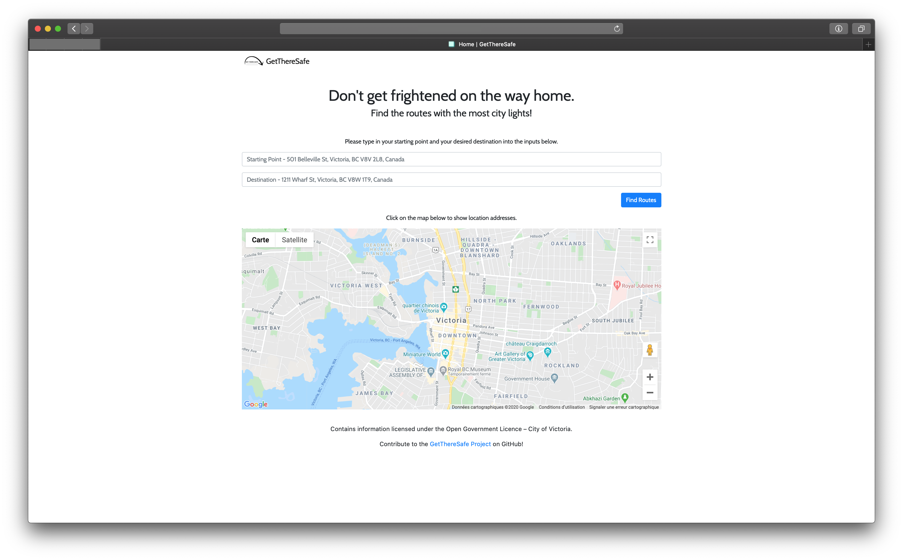
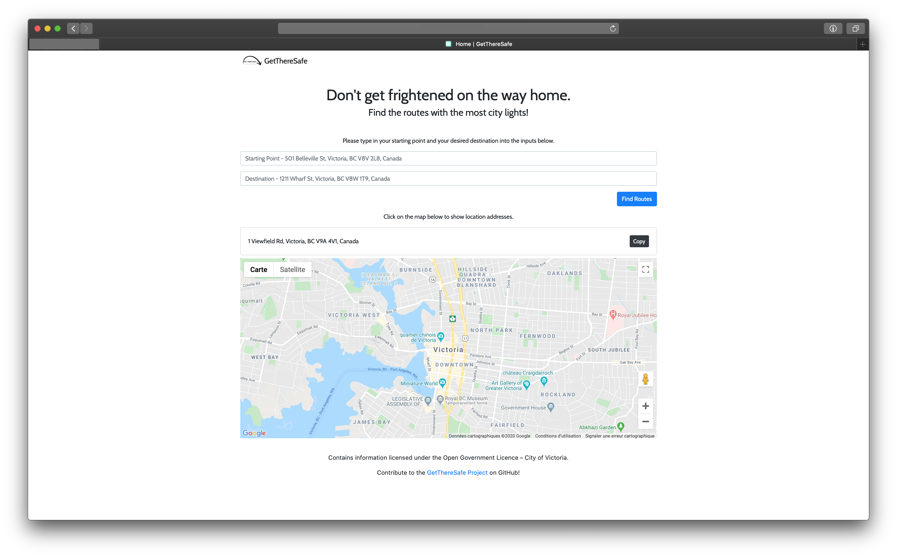
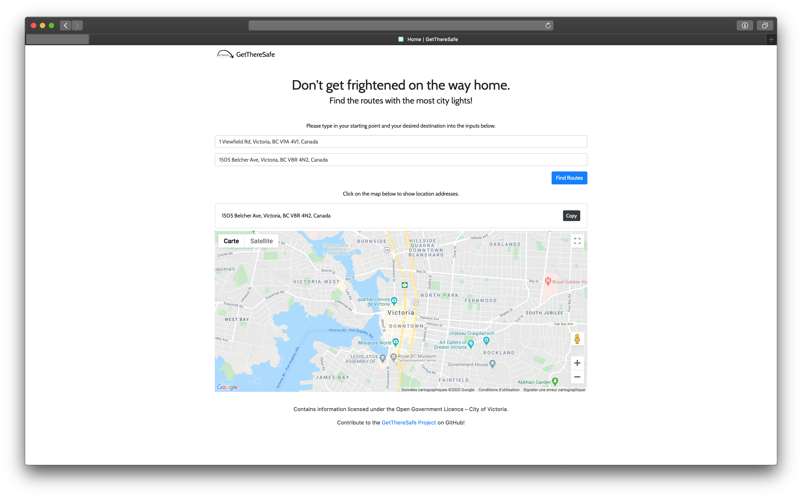
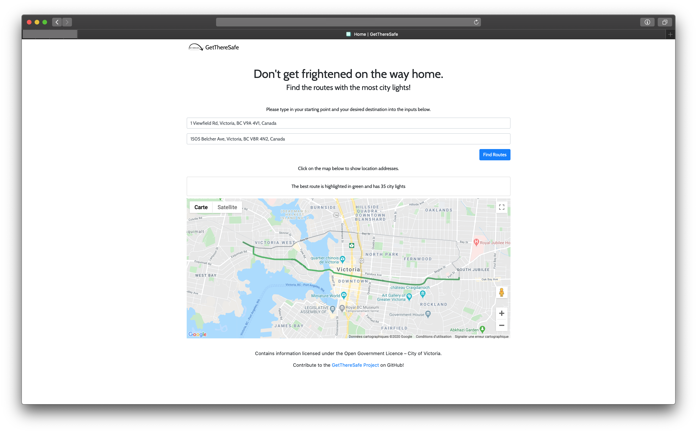

# GetThereSafe

GetThereSafe is an application that uses the [Google Maps Platform](https://cloud.google.com/maps-platform/) and the [City of Victoria Open Data](http://opendata.victoria.ca) to map out the route with the most city lights.

The [original application](https://devpost.com/software/gettheresafe) was created during [nwHacks 2016](https://2016.nwhacks.io). GetThereSafe won 1st prize for "Best Use of Data Analytics to Solve a Social Problem" during [nwHacks 2016](https://2016.nwhacks.io).

## Live Demo

There is no live demo because Google Maps Platform no longer has a free tier, and pricing is too expensive for a developer making no income on an application.

## Demo









## Contributors

* [ajdeziel](https://github.com/ajdeziel)
* [FlyteWizard](https://github.com/FlyteWizard)
* [moxuz](https://github.com/moxuz)

## Getting Started

By following the instructions below, you should be able to get a local copy working and be able to deploy your own instance of the GetThereSafe application with Heroku. 

### Requirements

* [git](https://git-scm.com)
* [Python 3](https://www.python.org)
* [Google Maps Platform Account](https://cloud.google.com/maps-platform/)
* [Heroku Account](https://www.heroku.com)
  * [Heroku CLI](https://devcenter.heroku.com/articles/heroku-cli)

### Local Development

1. Clone the repository on your local machine in your working directory and change into the `gettheresafe` directory.

```sh
cd working-directory

git clone git@github.com:FlyteWizard/gettheresafe.git

cd gettheresafe
```

2. Install all the dependencies in `requirements.txt`.

```sh
pip install -r requirements.txt

# or

pip3 install -r requirements.txt
```

3. Create a `.env` file based on `.env.example`.

```.env
GOOGLE_API_KEY=
DATABASE_URL=
```

4. Create a [Google Maps Platform Project](https://cloud.google.com/maps-platform/). You will need to activate `Geocoding API`, `Directions API`, and `Maps JavaScript API`. 

5. Generate a frontend API Key with Google Maps Platform. This key will be what we use on the frontend and will need to be restricted.

6. Generate a backend API Key with Google Maps Platform. This key will be what we use on the backend, and should be kept secret.

7. Add your backend API Key to your `.env` file. Replace `YOUR_SUPER_SECRET_API_KEY` with your backend API Key.

```.env
GOOGLE_API_KEY=YOUR_SUPER_SECRET_API_KEY
DATABASE_URL=
```

8. Add your frontend API Key to the `index.html` file. Replace `YOUR_NOT_SO_SECRET_API_KEY` with your frontend API Key.

```html
  <script src="https://maps.googleapis.com/maps/api/js?key=YOUR_NOT_SO_SECRET_API_KEY&callback=initMap" async defer></script> <!-- Google Map -->
```

9. Install [Postgres App](https://postgresapp.com/) and [Postgres CLI Tools](https://postgresapp.com/documentation/cli-tools.html).

10. Open and Initialize the Postgres App.

11. Start the Postgres App. You will need to Postgres App running when developing locally.  

12. Create a local database with the Postgres App CLI. You can name the database anything you want, but we will name it `gettheresafe`. 

```sh
createdb gettheresafe
```

13. If you have new data points to add to `citylights.csv` you can add them and then run `formatcsv.py` to format the new data points.

```sh
python formatcsv.py

# or

python3 formatcsv.py
```

14. Populate local database with contents from `citylightsdb.csv`.

```psql
psql gettheresafe

CREATE TABLE coords (ID integer, LNG float, LAT float);

\copy coords FROM './citylightsdb.csv' WITH (FORMAT csv);

TABLE coords;
```

15. Add your database URL to your `.env` file. 

```.env
GOOGLE_API_KEY=YOUR_SUPER_SECRET_API_KEY
DATABASE_URL=postgresql://localhost/gettheresafe
```

16. Run the app locally.

```sh
flask run

# or 

python app.py

# or 

python3 app.py
```

17. Head over to [http://127.0.0.1:5000/](http://127.0.0.1:5000/) to view your application.

### Deploying

1. Add [access restrictions](https://developers.google.com/maps/documentation/embed/get-api-key#key-restrictions) to your frontend API Key. This is important to prevent your API Key from being misused.

2. Create a new app on Heroku. Within your `gettheresafe` directory, run the following commands.

```sh
heroku create gettheresafe-username
```

3. Add Heroku Postgres Add-on.

```sh
heroku addons:create heroku-postgresql:hobby-dev --app gettheresafe-username
```

4. Add your local database to the Heroku Postgres database.

Run `heroku pg:info --app gettheresafe-username` to find your database name. Replace `[HEROKU_POSTGRESQL_MAGENTA]` with your Heroku Postgres database name.

```sh
heroku pg:push gettheresafe HEROKU_POSTGRESQL_MAGENTA --app gettheresafe-username
```

5. Add your Heroku Postgres database URL to your Heroku config vars.

```sh
heroku pg:promote HEROKU_POSTGRESQL_MAGENTA --app gettheresafe-username
```

6. Set your backend API Key in your Heroku config vars.

```sh
heroku config:set GOOGLE_API_KEY=YOUR_SUPER_SECRET_API_KEY --app gettheresafe-username
```

7. Push app to Heroku.

```sh
git push heroku master
```

8. Your app should be live at [https://gettheresafe-username.herokuapp.com](https://gettheresafe-username.herokuapp.com). 

## Tools

* [Bootstrap](https://getbootstrap.com)
* [Flask](https://flask.palletsprojects.com/en/1.1.x/)
* [Gunicorn](https://gunicorn.org)
* [Heroku](https://www.heroku.com)
* [Heroku CLI](https://devcenter.heroku.com/articles/heroku-cli)
* [Heroku Add-ons: Heroku Postgres](https://elements.heroku.com/addons/heroku-postgresql)
* [Postgres App](https://postgresapp.com/)
* [Google Maps Platform](https://cloud.google.com/maps-platform/)

## Resources

* [https://devcenter.heroku.com/articles/heroku-postgresql#local-setup](https://devcenter.heroku.com/articles/heroku-postgresql#local-setup)
* [https://developers.google.com/maps/documentation/](https://developers.google.com/maps/documentation/)
